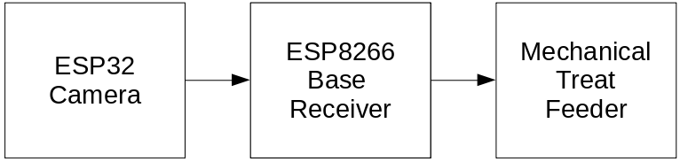

# Overview_CameraTreatFeeder

An automated treat feeder used to train dogs to not bark at people in the hallway.

This is a three-part project, consisting of:
## 1. ESP32 Camera
- Detects motion/movement of people in the hallway.
- Transmit a signal wirelessly to the base receiver when motion is detected over wifi.
## 2. ESP8266 Base Receiver / Control Center
- Receives the motion signal from the ESP32 camera.
- Shows an indicator light that motion was detected (to signal for dog to wait for treat).
- Listens for barking and turn off the light if barking detected within the set timeframe.
- Controls the actuation of the treat feeder if barking was not heard within the set timeframe.
## 3. Mechanical Treat Feeder
- The mechanical portion of the project used to dispense dog treats.

## FAQ

Why not integrate the camera and base receiver together and remove the wireless connection?

Separating these items allows for the treat dispensing to be done far away from the door.  Having a dog rush to the door for the treat doesn't promote the behaviour of ignoring the door that I'm looking for.

